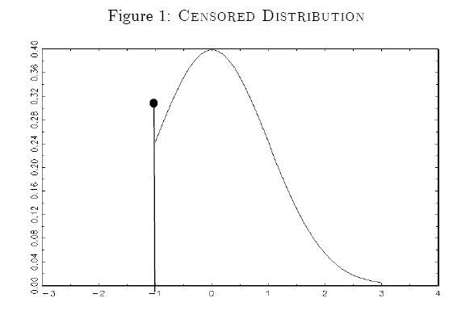
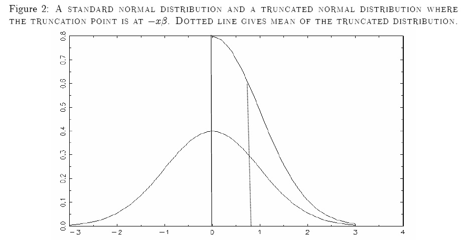

<!-- to compile: 
$ pandoc theory.md -o theory.pdf
 -->
# Corner Outcome Models

The purpose of this week's problem set is to estimate a censored
regression model known as the Tobit Model. Censored regression models
are relevant when the dependent variable has positive probability mass
at some point, but is continuous in other ranges. One example is
top-coded income data, where the only available information is whether a
particular individual has income at or above some threshold level. In
this case, the income data are right-censored and the censoring is
basically a "flaw" in the data. A variable can also be left-censored. In
this case, the observed variable equals the threshold value when the
original variables is less than or equal to the threshold level. Another
situation where censored regression models can be applied is the case of
corner solutions. These arise, e.g., in consumption problems, where a
corner solution exists when a consumer consumes nothing of a particular
commodity. In this case, the data is not " flawed" but censoring is due
to the behaviour of the economic agent.

A censored variable has positive probability mass at some point. The
case of a left-censored variable is illustrated in Figure 1 below.

## The Tobit Model

Consider the Tobit model for a randomly drawn observation

\begin{align}
\,y_{i}^{\ast } &=\mathbf{x}_{i}\mathbf{\beta }+u_{i} \quad \text{ where } 
u_{i}|\mathbf{x}_{i}\sim \mathcal{N}\left( 0,\sigma ^{2}\right) \\
y_{i} &= \max \left( 0,y_{i}^{\ast }\right)
\end{align}

$y_{i}^{\ast }$ is a latent variable that is incompletely observed: $y_{i}$ is observed only when $y_{i}^{\ast }>0$. $\mathbf{x}_{i}$ is an observed vector of covariates and $\mathbf{\beta }$ is a vector of parameters which we seek to estimate. With respect to the latter, the crucial assumption is that the random independent error term, $u_{i}$, is normal.

The conditional expectation $\mathrm{E}\left(y|\mathbf{x}\right)$ is

\begin{align}
\mathrm{E}\left( y|\mathbf{x}\right) &=\Pr \left( y=0|\mathbf{x}\right) \cdot 0+\Pr \left(
y>0|\mathbf{x}\right) \cdot \mathrm{E}\left( y|\mathbf{x},y>0\right)  \notag \\
&= \Pr \left( y>0|\mathbf{x}\right) \cdot \mathrm{E}\left( y|\mathbf{x},y>0\right),  \tag{1} 
\end{align} 

where $\Pr \left( y>0|\mathbf{x}\right)$ is given by 

\begin{align}
\Pr \left( y>0|\mathbf{x}\right) &=\Pr \left( y^{\ast }>0\mathbf{|x}\right) 
\notag \\
&=\Pr \left( \mathbf{x}\mathbf{\beta}+u>0\right)  \notag \\
&=\Pr \left( u>-\mathbf{x}\mathbf{\beta}\right)  \notag \\
&=\Pr \left( \frac{u}{\sigma } > \frac{-\mathbf{x}\mathbf{\beta}}{\sigma }\right)  \notag \\
&=1-\Phi \left( \frac{-\mathbf{x}\mathbf{\beta}}{\sigma }\right) 
=\Phi\left(\frac{\mathbf{x}\mathbf{\beta}}{\sigma }\right),  \tag{2} 
\end{align}

where the second-last equality follows from the normality assumption,
and the last one from the symmetry of the normal distribution. To obtain an expression for $\mathrm{E}\left(y|\mathbf{x},y>0\right)$ write

\begin{align}
\mathrm{E}\left( y|\mathbf{x},y>0\right) 
&= \mathrm{E}\left(y^\star \mathbf{|x},y^\star>0\right)   \notag \\
&= \mathrm{E}\left(\mathbf{x}\mathbf{\beta} + u \mathbf{|x}, \mathbf{x}\mathbf{\beta} + u >0\right)   \notag \\
&=\mathbf{x}\mathbf{\beta}+\mathrm{E}\left( u|\mathbf{x},u>-\mathbf{x}\mathbf{\beta}\right) \notag \\
&= \mathbf{x}\mathbf{\beta} + \mathrm{E}\left (   u \left  | \mathbf{x} , \frac{u}{\sigma} > \frac{-\mathbf{x}\mathbf{\beta}}{\sigma} \right. \right ). \tag{3}  
\end{align}

The only difficult part here is
$E\left( u|\mathbf{x},u/\sigma>-\mathbf{x\beta /\sigma}\right)$. Rewrite this as 

\begin{align}
\mathrm{E}\left (   u \left  | \mathbf{x} , \frac{u}{\sigma} > \frac{-\mathbf{x}\mathbf{\beta}}{\sigma} \right. \right ) 
&=\sigma \mathrm{E}\left( \left. 
\frac{u}{\sigma }\right\vert \frac{u}{\sigma }>\frac{-\mathbf{x}\mathbf{\beta}}{\sigma }\right) \\
&=\sigma \frac{\phi \left( -\mathbf{x}\mathbf{\beta}/\sigma \right) }{1-\Phi\left(-\mathbf{x}\mathbf{\beta}/\sigma \right) }\end{align}

The numerator gives the density at $-\mathbf{x}\mathbf{\beta}/\sigma$ and
the denominator gives the probability that
$u/\sigma >-\mathbf{x}\mathbf{\beta}/\sigma$, i.e., it scales the density up by the probability to observe an individual with $y^{\ast }>0$. This is illustrated in figure 2, where the density function for a standard normal is shown together with the density of a standard normal that is truncated at zero. The truncation implies that the mean of the truncated distribution is positive, as indicated by the dotted line.

Using the symmetry of the normal distribution, $1-\Phi \left( - \mathbf{x}\mathbf{\beta}/\sigma \right) =\Phi \left( \mathbf{x}\mathbf{\beta}/\sigma \right)$
and
$\phi \left( -\mathbf{x}\mathbf{\beta}/\sigma \right) =\phi \left( \mathbf{x\beta }/\sigma \right)$, we have that

$$
E\left( u|\mathbf{x},u>-\mathbf{x}\mathbf{\beta}\right) =\sigma \,\frac{\phi \left( 
\mathbf{x}\mathbf{\beta}/\sigma \right) }{\Phi \left( \mathbf{x}\mathbf{\beta}/\sigma
\right) } 
$$

The expression for $E\left( y|\mathbf{x},y>0\right)$ found in
(3) can then be written as:

$$
E\left( y|\mathbf{x},y>0\right) =\mathbf{x}\mathbf{\beta}+\sigma \lambda(\mathbf{x}\mathbf{\beta}/\sigma) \tag{4}
$$

where
$\lambda(\mathbf{x}\mathbf{\beta}/\sigma) \equiv \phi \left( \mathbf{x}\mathbf{\beta}/\sigma
\right) / \Phi \left( \mathbf{x}\mathbf{\beta}/\sigma \right)$ is called the
inverse Mills ratio, while the expression in
(1) becomes:

$$
\mathrm{E}\left( y|\mathbf{x}\right) =
  \mathbf{x}\mathbf{\beta}\cdot\Phi\left(\frac{\mathbf{x}\mathbf{\beta}}{\sigma }\right) + \sigma\,\phi\left(\frac{\mathbf{x}\mathbf{\beta}}{\sigma }\right). \tag{5}
$$

While $\lambda(z)$ does look weird, it also has sensible properties
which make sense for our model. In particular, $\lambda(z)>0$ for all
$z \in \mathbb{R}$ with $\lambda(z) \rightarrow 0$ for
$z \rightarrow \infty$ and $\lambda(z) \rightarrow \infty$ for
$z \rightarrow -\infty$.

## Estimation

The model has a distinct nonlinear component that depends on the
probability that $y_{i}^{\ast }>0$. The log-likelihood contribution for
observation $i$ therefore consists of two components:

\begin{align}
\ell_{i} = \mathbf{1}\left\{ y_{i}=0\right\} \log \left[ 1-\Phi \left( \mathbf{x}_{i}\mathbf{\beta }/\sigma \right) \right] +\mathbf{1}\left\{ y_{i}>0\right\}
\left\{ -\frac{1}{2}\left[ \log \left( 2\pi \right) +\log \left( \sigma
^{2}\right) +\left( y_{i}-\mathbf{x}_{i}\mathbf{\beta }\right) ^{2}/\sigma
^{2}\right] \right\} \tag{6}
\end{align}

For each observation, the likelihood contribution is determined either
by the first term which is the probability of $y_{i}=0$, or the second
term which is similar to the log-likelihood of the linear regression
model.

## Marginal effects

If the interest lies in the marginal effect of a change in a continuous variable $x_{j}$ conditional on $y>0$ then we simply differentiate eq. (4) wrt. $x_j$. Note that since we will be looking at $\mathrm{E}(y|\mathbf{x},y>0)$ and $\mathrm{E}(y|\mathbf{x})$ where we condition on $\mathbf{x}$, this means that we will have to evaluate the expressions at the particular value of $\mathbf{x}$ (When you see these conditional expectations, recall that you should really be thinking $\mathrm{E}(y|\mathbf{x} = \mathbf{x}^0,y>0)$, which will be a function of $\mathbf{x}^ 0$. In other words, in these expressions, $\mathbf{x}$ will be $1 \times K$ and not $N \times K$.).

In the following, we will make use of the fact that
$\frac{\partial }{\partial z}\lambda(z) = -\lambda(z)[z + \lambda(z)]$.
Writing $\lambda = \lambda (\mathbf{x}\mathbf{\beta}/\sigma)$ in order to keep notation simple, the first derivative of the expression in eq. (4) provides:

\begin{align}
\frac{\partial \mathrm{E}\left( y|\mathbf{x},y>0\right) }{\partial x_{j}} 
&=\beta_{j}+\sigma \frac{\partial\lambda}{\partial x_{j}}  \notag \\
&=\beta_{j}+\sigma \left[-\lambda \cdot \left(\mathbf{x}\mathbf{\beta}/\sigma +\lambda\right) \right]\left(\beta _{j}/\sigma \right)  \notag \\
&=\beta_{j}\left[ 1-\lambda \cdot \left( \mathbf{x}\mathbf{\beta}/\sigma +\lambda
\right) \right]. \tag{7} 
\end{align}

In the exercise, you will be asked to compute
$\partial \mathrm{E}(y|\mathbf{x} = \bar{\mathbf{x}},y>0)/\partial x_j$.

If the interest centers on
$\partial \mathrm{E}\left( y|\mathbf{x}\right)
/\partial x_{j}$, then the marginal effect is obtained by
differentiating the expression in (5) with respect to $\mathbf{x}$:

\begin{align}
\frac{\partial \mathrm{E}\left( y|\mathbf{x}\right) }{\partial x_{j}}
&= \beta_j\Phi\left(\frac{\mathbf{x}\mathbf{\beta}}{\sigma }\right) +
\mathbf{x}\mathbf{\beta}\,\phi\left(\frac{\mathbf{x}\mathbf{\beta}}{\sigma }\right)\frac{\beta_j}{\sigma} +  
\sigma\,\phi'\left(\frac{\mathbf{x}\mathbf{\beta}}{\sigma}\right)\frac{\beta_j}{\sigma} \tag{8} \\
&= \beta _{j}\Phi\left(\frac{\mathbf{x}\mathbf{\beta}}{\sigma }\right), \tag{9}
\end{align}

where $\phi'(z)=\partial\phi(z)/\partial z$ denotes the first derivative of the pdf of the standard normal distribution, and has the property that $\phi'(z)=-z\phi(z)$, (Try to prove it!) thus explaining why the last two terms of eq. (8) cancel out.

*Note:* Both functional forms for the marginal effect takes the form of a correction multiplied with the parameter for the variable in question. For eq. (9), the marginal effect must have the same sign as $\beta_j$ since $\Phi(z) > 0 \, \forall z$. The same is true for (7), because it turns out that the correction
factor there will be strictly between zero and one. 